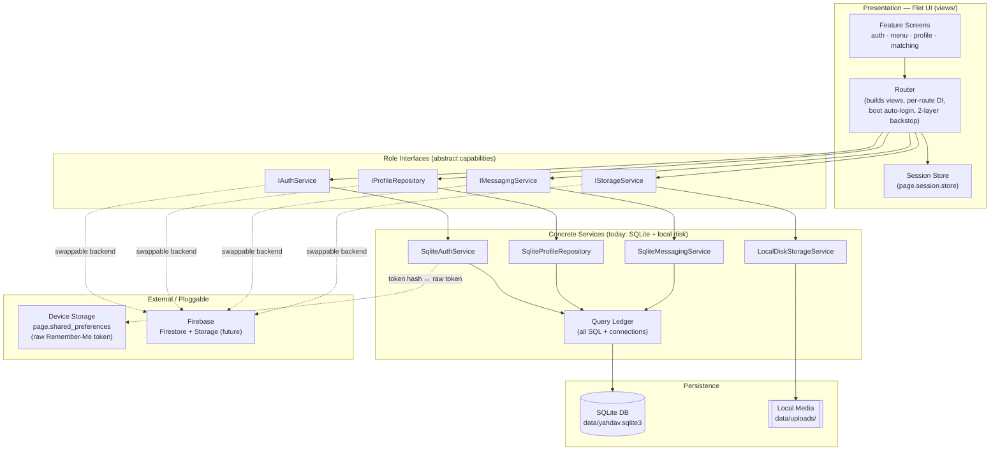
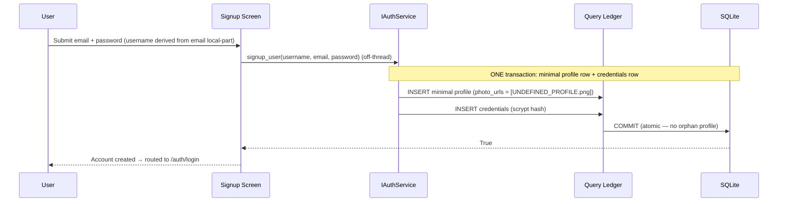
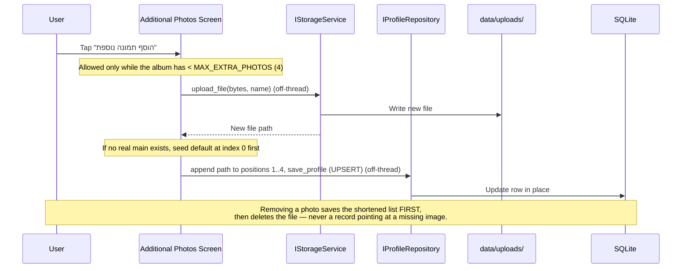

# Yahdav — Architecture Overview

> High-level system architecture for **Yahdav Dates App** ("יחדיו" = "together").
> This document reflects the **ground truth of the running code**. For the
> code-level engineering contract (invariants, the RTL recipe, threading rules,
> the two-layer render backstop, the Peer Layout Boundary Rule, persistence
> invariants, testing) see [`docs/ENGINEERING_CONTRACT.md`](./docs/ENGINEERING_CONTRACT.md).
> For UI/UX enforcement rules see [`docs/DESIGN_SYSTEM.md`](./docs/DESIGN_SYSTEM.md).

---

## System Overview

**Yahdav** is a Hebrew-language, right-to-left dating application built for the
**50+ community**. Its purpose is to make online dating accessible and safe for
an older audience through deliberately oversized, simplified, senior-friendly
screens that all share one visual language.

The system lets a member:

- **Register and sign in** (with an optional "Remember Me" token-based auto-login
  on the device).
- **Edit a profile** — name, gender, birth date, city/region, a short bio, a
  **main profile picture**, and an album of up to four **additional photos**.
- **Discover other members** and view their **read-only** profiles.
- **Message one-on-one** (text today; the schema and enums already reserve voice
  notes and images as first-class message types).

Architecturally it follows **light Clean Architecture** with **Interface
Segregation**: the UI depends only on small abstract "role" capabilities, never
on a concrete backend. SQLite (plus local-disk media) is the persistence backend
today; the same four interfaces allow a Firebase backend to be swapped in by
editing only the composition root.

---

## Tech Stack

| Layer | Technology | Notes |
|---|---|---|
| **Frontend / UI** | [Flet](https://flet.dev) ≥ 0.84 (Flutter-rendered Python UI) | Single codebase; full RTL; mobile-portrait desktop window (450×800); `ft.run(main, assets_dir=…)` |
| **Backend (app logic)** | Python 3.10+ (hard-guarded at entry) | Four role-interface services + a central Router; no separate server process (local-first) |
| **Database** | SQLite (WAL mode, FK ON, autocommit + explicit transactions) | Accessed through a single **Query Ledger** (`sqlite_queries.py`); services hold zero inline SQL |
| **Media / File Storage** | Local disk (`data/uploads/`) | Behind `IStorageService`; an object store can replace it with one constructor line |
| **Authentication** | scrypt password hashing · token-based "Remember Me" | Device holds only an opaque token (in `page.shared_preferences`); the DB stores its SHA-256 hash |
| **Device storage** | `page.shared_preferences` (async) | Holds the raw remember-me token **only** — no JSON file, no `client_storage` |
| **Cloud / Hosting** | Local-first desktop app | No always-on server today; `firebase_backend.py` is a left-as-is stub for a future cloud backend |

---

## High-Level Architecture



**How to read it**

- The UI talks **only** to the four role interfaces — never to SQLite, the
  filesystem, or a concrete class.
- The **Router** is the single place screens are constructed; it injects exactly
  the interface(s) each screen needs, owns the cold-boot auto-login decision,
  and wraps every view build in a **two-layer black-screen backstop**.
- All blocking work (SQLite + disk I/O) runs **off the UI thread** via
  `asyncio.to_thread`, so the screen never freezes.
- Swapping SQLite/local-disk for Firebase means re-pointing the four interfaces
  in `app.py` — the UI and router are untouched.

---

## Core Components & Modules

| Module | Interface | Responsibility (plain English) |
|---|---|---|
| **User Management / Auth** | `IAuthService` | Creates accounts (`signup_user → bool`), verifies logins (`login_user → uid \| None`), exposes existence probes and **static** input validators, and mints/validates/**revokes** the "Remember Me" device token. Knows nothing about profiles, photos, or chat. |
| **Profile System** | `IProfileRepository` | The source of truth for a member's profile — `get/save/find/delete`, the `discover` feed, safety flags, the block list, and a lazy `ensure_default_photo` migration (write-free reads: the heal runs as a decoupled background task, never chained into a fetch). Owns the ordered **photo list** (main picture + additional photos) as data; it never touches files. |
| **Image Upload / Storage** | `IStorageService` | Stores and deletes raw photo **bytes** under `data/uploads/`, returning a stable path reference. Generates collision-free, path-safe filenames and refuses to delete anything outside its own root. The profile system stores only the returned path; the two are deliberately separate. |
| **Messaging** | `IMessagingService` | One-on-one direct messages — `send`, **cursor-paginated** history (a `created_at` cursor, not an `offset` — portable to a Firestore `startAfter`), mark-read, unread counts, conversation list. Supports `TEXT`/`AUDIO`/`IMAGE` message types. Intentionally **block-agnostic** (the block rule lives in the profile layer). |
| **Router & Session** | `utils/router.py` + `page.session.store` | The only place views are constructed; performs per-route DI, owns boot-time auto-login (`resolve_initial_route`), and guards every build with a two-layer backstop so a failed build can never leave a black page. The session store holds cross-screen state (current user id/email, selected peer). |
| **Query Ledger** | `services/sqlite_queries.py` | Centralizes **every** SQL statement, schema, index, pragma, and the `connection()` / `transaction()` context managers. Concrete services contain zero inline SQL. |
| **UI Shell & Design System** | `views/common`, `components` | One shared full-screen background + translucent card used by every screen, the senior-friendly input/button primitives, the shared photo helpers, and the RTL layout recipe. Enforces visual consistency for the 50+ audience. |

**Key relationships**

- **Decoupling:** the four concrete services share only a `db_path` / storage-root
  `str` — never a base class or each other.
- **Profile ↔ Storage split:** photos are stored as files by the storage module;
  the profile module stores only the *path string*. A profile save never moves
  bytes, and a file write never touches the database.
- **Persistence safety:** profile saves UPSERT the existing row in place (never
  delete-and-reinsert), so editing a profile or its photos can never
  cascade-wipe a member's credentials or remembered sessions.

---

## Feature Screens & Routes

Every authenticated screen is built from the same shell (`background_screen` +
`translucent_card`). The router's route table is the single source of view
construction:

| Route | View | Interfaces injected |
|---|---|---|
| `/auth/welcome` | `WelcomeView` | — (pure navigation) |
| `/auth/login` | `LoginView` | `IAuthService` |
| `/auth/signup` | `SignupView` | `IAuthService` |
| `/menu` | `MainMenuView` | — (pure navigation; owns logout) |
| `/profile/me` | `MyProfileView` | `IProfileRepository` + `IStorageService` |
| `/profile/photos` | `AdditionalPhotosView` | `IProfileRepository` + `IStorageService` |
| `/matching/discover` | `DiscoverView` | `IProfileRepository` |
| `/discover/profile` | `UserProfileView` (read-only peer) | `IProfileRepository` |
| `/chat/history` | `MatchesView` (conversation list) | `IMessagingService` + `IProfileRepository` |
| `/chat/new` | `ChatView` | `IMessagingService` |

> `PlaceholderView` and the `onboarding/` package exist for future routes but are
> **not wired into the active route table** — chat history is now the real
> `MatchesView`, not a placeholder. Any unknown route falls back to
> `/auth/welcome`.

---

## Data Flow (User Profile & Images)

A member's photos live in one ordered list: **position 0 is the single main
profile picture**; **positions 1–4 are the additional album photos**. The main
picture is never empty — it falls back to the bundled `UNDEFINED_PROFILE.png`
template whenever none is set (resolved at fetch time *and* at render time).

### a) A user registers → default main picture seeded



**In words:** signup derives the username from the email's local-part and creates
the account in a single transaction. The minimal profile is pre-seeded with the
default template at photo index 0 (`ProfileQueries.minimal_profile_params`), so a
brand-new member already has a valid main picture. Onboarding isn't built yet, so
a successful signup routes to `/auth/login`.

### b) A user updates their main profile picture

```mermaid
sequenceDiagram
    participant U as User
    participant UI as My Profile Screen
    participant Picker as FilePicker (view service)
    participant Store as IStorageService
    participant Profile as IProfileRepository
    participant FS as data/uploads/
    participant DB as SQLite

    U->>UI: Tap the main picture
    UI->>Picker: pick_files(with_data=True) (awaitable, no callback)
    Picker-->>UI: Selected image bytes
    UI->>Store: upload_file(bytes, name) (off-thread)
    Store->>FS: Write new <uuid>.<ext> file
    Store-->>UI: New absolute file path
    UI->>Profile: save_profile (path at index 0; UPSERT) (off-thread)
    Profile->>DB: Update row in place (no cascade)
    UI->>Store: delete_file(old main) — never the bundled default
    UI-->>U: New profile picture displayed
```

**In words:** the new image is written to disk **first**, then the profile is
UPSERTed with the new path at index 0 (one active main picture, always). Only
after the save succeeds is the old file deleted (the bundled default template is
never deleted — it lives outside the storage root). If the save fails, the
in-memory entity is rolled back and the just-written orphan file is deleted.

### c) A user manages additional album photos



**In words:** additional photos are managed on a separate screen from the main
picture. Index 0 is always reserved for the main picture — adding the first extra
to an account with no real main seeds the default template at index 0 so an extra
can never silently become the main. Removing a photo persists the shortened list
**before** deleting the file, so the database never references a missing image.

---

## What is hardened (and why it matters)

Recent work added explicit **render seams** and a **two-layer router backstop**
so partial, untrusted, or legacy data can never produce a blank/black screen on
the Flet desktop client. The detail lives in the engineering contract; the
shape is:

- **Router backstop (layer 1 + 2).** A view factory that raises during `build()`
  is caught and replaced by a styled error card; if *that* (or the mount itself)
  also fails, a completely bare, dependency-free `ft.View` is mounted. After this,
  a blank page is mathematically unreachable.
- **Fail-soft deserialization.** `SqliteProfileRepository` parses every JSON
  value-object column through total helpers that degrade malformed/empty/missing
  data to a safe default — one corrupt row can never crash the view-builder thread.
- **Per-item render isolation.** Discover, Matches, and Chat build each
  card/row/bubble in its own try/except, so a single bad record is skipped (with
  a log line) rather than aborting the whole list.
- **Never-null main picture.** Resolved both at the fetch layer
  (`_with_default_main`) and at every render (`resolve_main_photo` /
  `_safe_photo_src`), with `ft.Image` `error_content` fallbacks.

See **[`docs/ENGINEERING_CONTRACT.md`](./docs/ENGINEERING_CONTRACT.md)** for the
hard rules behind each of these.
